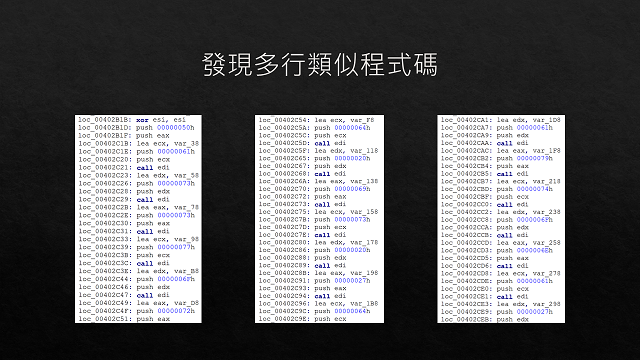
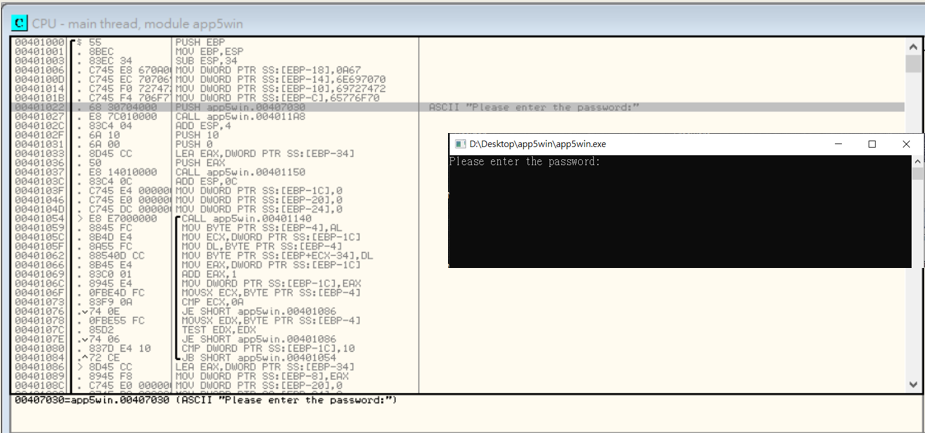
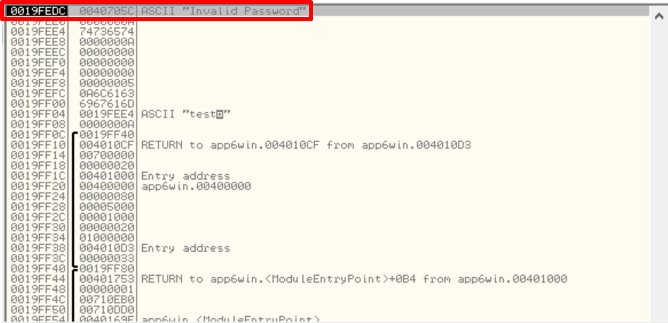
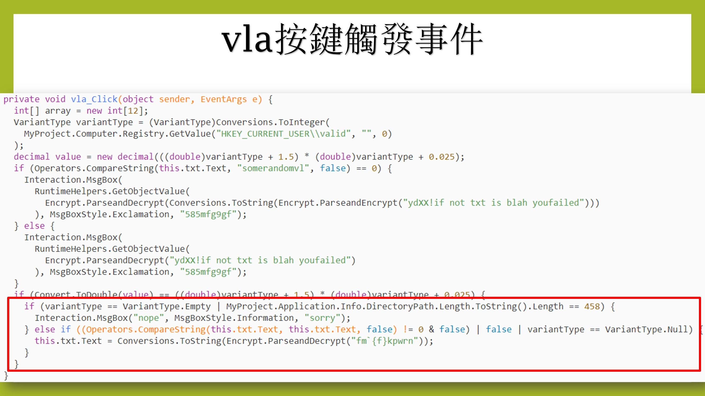

# Project6-3_Hackthissite


## 1051409 張峻維 - Application Challenge 3：Find the Password.
### 題目：
題目只有一個程式，打開之後能輸入任意數字或是英文，並且有一個Authenticate按鍵可以點。

### 初步嘗試：
 一開始我隨意輸入各種隨機的英文和數字組合，按下Authenticate後都下面訊息顯示Reading data，但是無論多久都沒有進一步的反應。


### 上網搜尋：
1. 在[這個網站](https://www.youtube.com/watch?v=C5SbCX24_Ug)
找到下一步驟提示，需要使用Wireshark
2. 在啟動Wireshark之後找到了這個程式傳送的封包，這個封包是屬於http的protocol。

3. 打開之後發現有一個網址，點開連結頁面顯示false。


### 解法：
```
看到false之後馬上聯想到他會是一個boolean值，只要讓他變成true，應該就能解出來了，但是這邊我並不知道要用甚麼程式才能修改這個檔案，於是從剛剛的影片和[這個網站](http://sp4hack.blogspot.com/2012/09/hack-this-site-application-3.html
)中找到了Hex Workshop的編輯器來修改這個程式。
```
Step1: 打開Hex Workshop

Step2: 找到true和false

Step3: 將true改成false,false改成true後重新存成另一個檔案。

Step 4: 打開新的檔案，再一次隨機輸入任意英文或數字組合，跳出新視窗，上面顯示密碼。


```
確認結果正確
```


## 1053328 黃子庭 - Application Challenge 4：Press the Button.
### 題目：
為一個有兩顆按鈕的應用程式，按下按鈕就能顯示寫有密碼的對話視窗。
### 初步嘗試：
1. 滑鼠游標在其中一個按鈕時，這個按鈕disable，而另一個按鈕enable，無法使用滑鼠按下按鈕。

2. 使用鍵盤的方法控制也無法按下按鈕。

### 上網搜尋：
1. 在[這個網站](https://www.hackthissite.org/forums/viewtopic.php?f=16&t=5955)
獲得關鍵提示，需要[下載VB反組譯器](http://www.hackthissite.org/pages/programs/programs.php)


2. 反組譯後不知道如何修改程式，所以又在[這個網站](http://www.nullsecurity.org/article/hackthissite_org_application_challenges#app_04w)找到解法，修改程式讓按鈕都enable。

### 解法：
```
由於修改組合語言的程式有點複雜，所以決定不採用網路上的方法。
思考方向：這個桌面應用程式不連網也能使用，所以答案一定會寫死在程式裡。
```

```
推測：如果是按下按鈕後會跑出答案，那答案應該會寫在click的function裡。
```

```
發現：有多行連續而且可疑的push程式，看起來很像文字的編碼。
```

```
嘗試：比對ASCII碼
得到結果 -> Password is 'daytona'
```

```
確認結果正確
```


## 1053356 胡嘉芸 - Application Challenge 5：Find the Password.
### 題目：
```
題目給一個執行檔，找出密碼
```
### 初步嘗試：
```
直接執行執行檔，輸入任何字串按enter後執行檔直接關閉
```

```
開啟cmd執行執行檔，隨意輸入任何字串按enter後，得到 Invalid Password 
```

### 上網搜尋：
查找反組繹器ollyDbg使用方法，找到這篇[文章](https://ithelp.ithome.com.tw/articles/10188286)
使用方法是下面這張圖

### 解法：
```
首先從逆向視窗找出”ASCII "Please enter the password: "”
```

```
在下一行 CALL app5win.004011A8 設為中斷點
```

```
按下執行後會停在剛剛設中斷點的地方，再從堆疊視窗中找到”ASCII "Please enter the password:”
記下”ASCII "Please enter the password:”的記憶體位址0019FEF8
```

```
在資料視窗查詢剛剛記下的記憶體位址0019FEF8
```

```
查詢後可以發現記憶體位址0019FEF8下兩行有被打亂的英文 g…ppinrtripowe
```

```
重新排列g…ppinrtripowe後可得出一個英文單字，為powertripping
試著將powertripping輸入到app5win.exe，得到The password is powertripping
```

```
將找到的powertripping輸入Application Challenge 5 得到以下畫面，成功找出密碼
```

### 使用Application Challenge 6的方法是否能找出Password：
```
從逆向視窗找出”ASCII “Invalid Password””
在下一行設中斷點並執行程式
```

```
在中斷點處的堆疊視窗中找出”ASCII “Invalid Password””
發現找出的位址跟上面找出”ASCII “Please enter the password: ””的結果一樣
```


```
因為找出的位址一樣，所以找出來的答案也會一樣
```


```
結果為使用Application Challenge 6的方法是可以找出Password的。
```

## 1053331 徐永棚 - Application Challenge 6：Find the Password.
### 題目：
```
題目為一個執行檔，透過此執行檔找出密碼
```
### 初步嘗試：

1. 打開執行檔後隨便輸入，輸入完後按enter視窗就直接關閉，沒有獲得任何線索。


### 上網搜尋：

1.看到HackThisSite[討論區](https://www.hackthissite.org/forums/viewtopic.php?f=16&t=5957&sid=c14b9394e488d734c01f43ed7a955c6e)有人有建議的工具(Ollydbg)可以解這一題便去下載試試看看


2.打開Ollydbg但因為不懂他如何操作，所以便去網路上搜尋[相關資料](https://ithelp.ithome.com.tw/articles/10188286)


```
1.逆向視窗：顯示為 OllyDBG 進行資料分析後所解析的程式內容（解析為 X86 組合語言），載入後的第一行即為程式的進入點（Entry point），除了解析出程式碼外，還會顯示使用者目前逐步分析到哪一行程式碼。
2.暫存器視窗：顯示目前各種暫存器（registers）所儲存的數值，一般 32-bit 的程式，暫存器就會是 32-bit。
3.資料視窗：顯示為目前記憶體中的位置與數值。
4.堆疊視窗：顯示堆疊（stack）內容的視窗。
```
### 解法：
Step1: 打開OllyDbg並開啟app6win.exe

Step2: 按下執行

Step3: 在逆向視窗(左上)按下搜尋字串

Step4: 搜尋 ASCII "Invalid Password"

Step5: 搜尋後對下一行設中斷點

Step6: 在程式中隨便輸入答案

Step7: 堆疊視窗(右下)第一行出現ASCII "Invalid Password"的位置

Step8: 資料視窗(左下)搜尋剛剛中斷的位置

Step9: 資料視窗(左下)發現隱藏的單字

Step10: 將單子重組過後得到答案(cal.magi -> magical)


### 使用Application Challenge 5的方法是否能找出Password：
```
不行。因為無法找到ASCII "Please enter the Password"。無法找到整個字串叫做"Please enter the Password"，有可能是因為他都是用一個一個字元不斷去呼叫所以才找不到整個字串(如下圖)，因此只能用Application Challenge 6的方式去做。
```

## 1051556 張楚翎 - Application Challenge 9：Press the Button.
### 題目
```
題目為一個執行檔，每個button都有自己的提示音。
```
### 初步嘗試
1.每個button都按下去一次，除了會發出不同聲音之外，甚麼事情也沒發生。

 
2.發現執行檔就只是一個介面，並無任何線索可以找到解答的地方，於是上網找了可以開啟執行檔的程式，最後使用的是OllyDbg反組譯器。

### 上網搜尋

1.解題過程中，有上網找看看其他人的[解法](http://www.nullsecurity.org/article/hackthissite_org_application_challenges#app_09w)
但因為他的方法偏複雜，且沒有完整的流程，所以其實沒有很清楚到底在幹嘛。
2.另一個問題是我使用的這個反組譯程式中，因需要改寫裡面的內容，所以針對這個問題，也上網找了對應的[解決辦法](https://blog.csdn.net/BetaBin/article/details/7309415)。


### 解法

Step1: 查看Text string 裡有無相關訊息

Step2: 按下第一次執行  修改對應的數字200->100

(修改後)


Step3: 按下第二次執行  修改對應的數字600->500

(修改後)


Step 4: 按下第三次執行  修改對應的數字1100->1000

(修改後)


Step 5: 將修改完畢的檔案另存新檔後，再開啟此檔案的執行檔，就可以找到答案了。


### 遇到的困難
```
利用利用OllyDbg開啟題目的執行檔之後遇到記憶體不太正確的問題，
所以查詢了一下有關開啟檔案的方式
```
在[記憶體段點](https://morosedog.gitlab.io/j.j.blogs/ollydbg-20190708-OllyDBG-4/)發現模式錯誤，
所以將此模式調回來就可以看到正常的指令了。
(錯誤位址)

(修改後)


## 1053332 吳芷芳 - Application Challenge 14：It's Windows only for a reason
### 題目：
```
題目為一個執行檔，有一個textBox可以輸入任意文字，及一顆Button
```
### 初步嘗試與參考文件
1.輸入任意字串，按下每一個視窗上唯一的button，會由左至右依序顯示下一個視窗

 
2.嘗試數次輸入隨機字串後，皆顯示相同視窗內容，於是搜尋[網路資源](http://www.nullsecurity.org/article/hackthissite_org_application_challenges#app_14w)，發現它是C#編碼的執行檔案
，於是下載C#的反組譯器 - [ILSpy](https://discoverdot.net/projects/ilspy)
### 解法
```
Step1: 查看視窗內的元件所對應到的變數名稱與函式
```

```
Step2-1: 觀察vla這顆button的觸發事件，發現有一個條件式會比對textBox的內容是否為"somerandomvl"
```

```
Step2-2: 將"somerandomvl"作為textBox的輸入值所得到的結果，發現這並不能得到答案
```

```
Step2-3: 仔細觀察條件式裡面的內容，條件符合與否都無法得到答案
```

```
Step3-1: 接著觀察下面一個條件式，會發現條件恆成立
```

```
Step3-2: 程式永遠無法跑到else if內，於是我們觀察else if裡面的內容，他會將"fm\`{f}kpwrn"解密
```

```
Step3-3: 觀察解密函式
```

```
Step4: 利用python實現解密函式，將"fm\`{f}kpwrn"解密，得到答案"ihatethereg"
```

