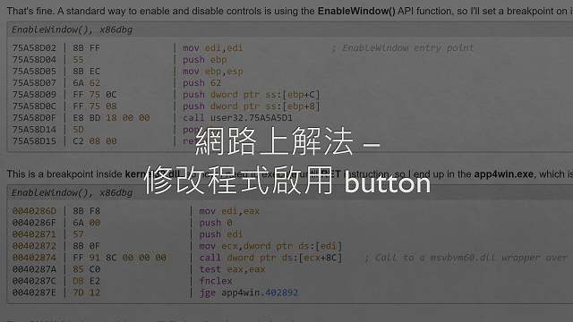

# Project6-3_Hackthissite


## 1053328 黃子庭 - Application Challenge 4：Press the Button.
### 題目：
為一個有兩顆按鈕的應用程式，按下按鈕就能顯示寫有密碼的對話視窗。
### 初步嘗試：
1. 滑鼠游標在其中一個按鈕時，這個按鈕disable，而另一個按鈕enable，無法使用滑鼠按下按鈕。

2. 使用鍵盤的方法控制也無法按下按鈕。

### 上網搜尋：
1. 在[這個網站](https://www.hackthissite.org/forums/viewtopic.php?f=16&t=5955)
獲得關鍵提示，需要[下載VB反組譯器](http://www.hackthissite.org/pages/programs/programs.php)


2. 反組譯後不知道如何修改程式，所以又在[這個網站](http://www.nullsecurity.org/article/hackthissite_org_application_challenges#app_04w)找到解法，修改程式讓按鈕都enable。

### 解法：
```
由於修改組合語言的程式有點複雜，所以決定不採用網路上的方法。
思考方向：這個桌面應用程式不連網也能使用，所以答案一定會寫死在程式裡。
```

```
推測：如果是按下按鈕後會跑出答案，那答案應該會寫在click的function裡。
```

```
發現：有多行連續而且可疑的push程式，看起來很像文字的編碼。
```

```
嘗試：比對ASCII碼
得到結果 -> Password is 'daytona'
```

```
確認結果正確
```


## 1053356 胡嘉芸 - Application Challenge 5：Find the Password.
### 題目：
### 初步嘗試：
### 上網搜尋：
### 解法：
### 使用Application Challenge 6的方法是否能找出Password：


## 1053331 徐永棚 - Application Challenge 6：Find the Password.
### 題目：
```
題目為一個執行檔，透過此執行檔找出密碼
```
### 初步嘗試：

1. 打開執行檔後隨便輸入，輸入完後按enter視窗就直接關閉，沒有獲得任何線索。


### 上網搜尋：

1.看到HackThisSite[討論區](https://www.hackthissite.org/forums/viewtopic.php?f=16&t=5957&sid=c14b9394e488d734c01f43ed7a955c6e)有人有建議的工具(Ollydbg)可以解這一題便去下載試試看看


2.打開Ollydbg但因為不懂他如何操作，所以便去網路上搜尋[相關資料](https://ithelp.ithome.com.tw/articles/10188286)


```
1.逆向視窗：顯示為 OllyDBG 進行資料分析後所解析的程式內容（解析為 X86 組合語言），載入後的第一行即為程式的進入點（Entry point），除了解析出程式碼外，還會顯示使用者目前逐步分析到哪一行程式碼。
2.暫存器視窗：顯示目前各種暫存器（registers）所儲存的數值，一般 32-bit 的程式，暫存器就會是 32-bit。
3.資料視窗：顯示為目前記憶體中的位置與數值。
4.堆疊視窗：顯示堆疊（stack）內容的視窗。
```
### 解法：


## 1051556 張楚翎 - Application Challenge 9：Press the Button.
### 題目
```
題目為一個執行檔，每個button都有自己的提示音。
```
### 初步嘗試
1.每個button都按下去一次，除了會發出不同聲音之外，甚麼事情也沒發生。

 
2.發現執行檔就只是一個介面，並無任何線索可以找到解答的地方，於是上網找了可以開啟執行檔的程式，最後使用的是OllyDbg反組譯器。

### 上網搜尋

1.解題過程中，有上網找看看其他人的[解法](http://www.nullsecurity.org/article/hackthissite_org_application_challenges#app_09w)
但因為他的方法偏複雜，且沒有完整的流程，所以其實沒有很清楚到底在幹嘛。
2.另一個問題是我使用的這個反組譯程式中，因需要改寫裡面的內容，所以針對這個問題，也上網找了對應的[解決辦法](https://blog.csdn.net/BetaBin/article/details/7309415)。


### 解法

Step1: 查看Text string 裡有無相關訊息

Step2: 按下第一次執行  修改對應的數字200->100

(修改後)


Step3: 按下第二次執行  修改對應的數字600->500

(修改後)


Step 4: 按下第三次執行  修改對應的數字1100->1000

(修改後)


Step 5: 將修改完畢的檔案另存新檔後，再開啟此檔案的執行檔，就可以找到答案了。


### 遇到的困難
```
利用利用OllyDbg開啟題目的執行檔之後遇到記憶體不太正確的問題，
所以查詢了一下有關開啟檔案的方式
```
在[記憶體段點](https://morosedog.gitlab.io/j.j.blogs/ollydbg-20190708-OllyDBG-4/)發現模式錯誤，
所以將此模式調回來就可以看到正常的指令了。
(錯誤位址)

(修改後)


