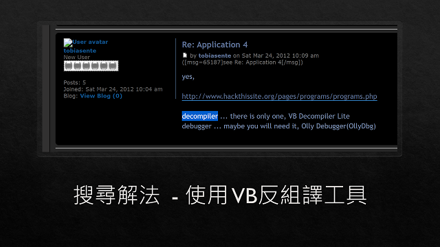

# Project6-3_Hackthissite


## 1053328 黃子庭 - Application Challenge 4：Press the Button.
### 題目：
為一個有兩顆按鈕的應用程式，按下按鈕就能顯示寫有密碼的對話視窗。
### 初步嘗試：
1. 滑鼠游標在其中一個按鈕時，這個按鈕disable，而另一個按鈕enable，無法使用滑鼠按下按鈕。

2. 使用鍵盤的方法控制也無法按下按鈕。

### 上網搜尋：
1. 在[這個網站](https://www.hackthissite.org/forums/viewtopic.php?f=16&t=5955)
獲得關鍵提示，需要[下載VB反組譯器](http://www.hackthissite.org/pages/programs/programs.php)


2. 反組譯後不知道如何修改程式，所以又在[這個網站](http://www.nullsecurity.org/article/hackthissite_org_application_challenges#app_04w)找到解法，修改程式讓按鈕都enable。

### 解法：
```
由於修改組合語言的程式有點複雜，所以決定不採用網路上的方法。
思考方向：這個桌面應用程式不連網也能使用，所以答案一定會寫死在程式裡。
```

```
推測：如果是按下按鈕後會跑出答案，那答案應該會寫在click的function裡。
```

```
發現：有多行連續而且可疑的push程式，看起來很像文字的編碼。
```

```
嘗試：比對ASCII碼
得到結果 -> Password is 'daytona'
```

```
確認結果正確
```


## 1051556 張楚翎 - Application Challenge 7：Press the Button.
### 題目
1. 題目為一個執行檔。
2. 每個button都有自己的提示音，但按下他們並未有任何變化。

### 初步嘗試


### 上網搜尋

### 解法

Step1: 查看Text string 裡有無相關訊息

Step2: 按下第一次執行  修改對應的數字200->100

(修改後)


Step3: 按下第二次執行  修改對應的數字600->500

(修改後)


Step 4: 按下第三次執行  修改對應的數字1100->1000

(修改後)


### 遇到的困難
```
利用利用OllyDbg開啟題目的執行檔之後遇到記憶體不太正確的問題，
所以查詢了一下有關開啟檔案的方式
```
在[記憶體段點](https://morosedog.gitlab.io/j.j.blogs/ollydbg-20190708-OllyDBG-4/)發現模式錯誤，
所以將此模式調回來就可以看到正常的指令了。
(錯誤位址)

(修改後)


